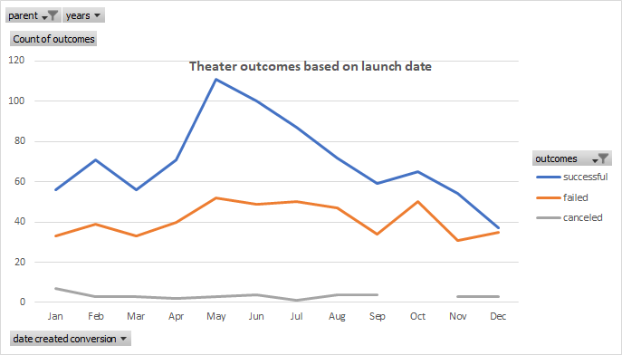
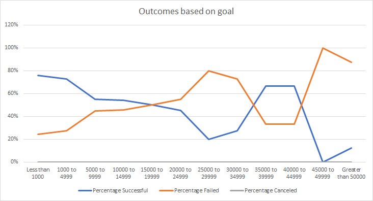

# kickstarter-analysis

## Overview of the Project

### Background
Louise is an up and coming playwright who wants to start a crowfunding campaign to fund her play, Fever. We are trying to help her by analyzing a dataset to determine if there are certain factors that make a campaign successful.

For the purpose of this analysis, we are using a Kickstarter dataset. [Dataset Link](./Kickstarter_challenge.xlsx)

### Purpose
Louise’s play Fever almost reached it's fundraising goal in a short time. The purpose of this analysis is to provide her with insights on how different campaigns fared in relation to their launch dates and their funding goals.

## Analysis and Challenges

### Analysis Overview
There were two different analyses done. 

1. The first was to examine the outcome of Kickstarter campaigns with respect to the launch date of the campaign. Pivot tables and charts were used for this analysis and the pivot chart comparing campaign outcomes depending on start month of the campaign is shown below.

2. The second was to examine the outcome of Kickstart campaigns with respect to the campaign goal amount. Excel formulas were primarily used for this analysis and the line graph comparing campaign outcomes depending on goal ranges is shown below.

### Challenges

One of the possible challenges that can be encountered is that the initial set of data doesn't have a clear formatting on launch date and deadline date and it's a blocker to the analysis unless it's converted to a format that excel can work with.

## Results

### Conclusions based on Theater outcomes based on Launch Date

1. The month of may had the highest number launched campaigns that were successful.
2. There is almost of a 50-50 chance of success/failure for campaigns launched in Decemeber.

### Conclusion based on Outcomes based on goals

1. The percentage of successful campaings dropped as the range of the goal increased. Essentially, higher the goal amount, lower the chance of succcess. (This conclusion is skewed at very high goal ranges due to the low number of data points present)

### Limitations of dataset, recommendations

There are a lot of subjective factors that could lead to the success of a campaign. For example, there are several campaigns which are successful with very low number of backers. It could be a factor of involvement from friends and family or a very enthusiastic backer. The limitation of the dataset is that it's hard to capture these subjective factors and hence it's limited in possibilties.

A campaign that is staff picked may have a higher chance of success. A campaign that is backed by spotlight may have a higher chance of success. These are items for further analysis with graphs like staff picked vs outcomes and spotlight vs outcomes.
